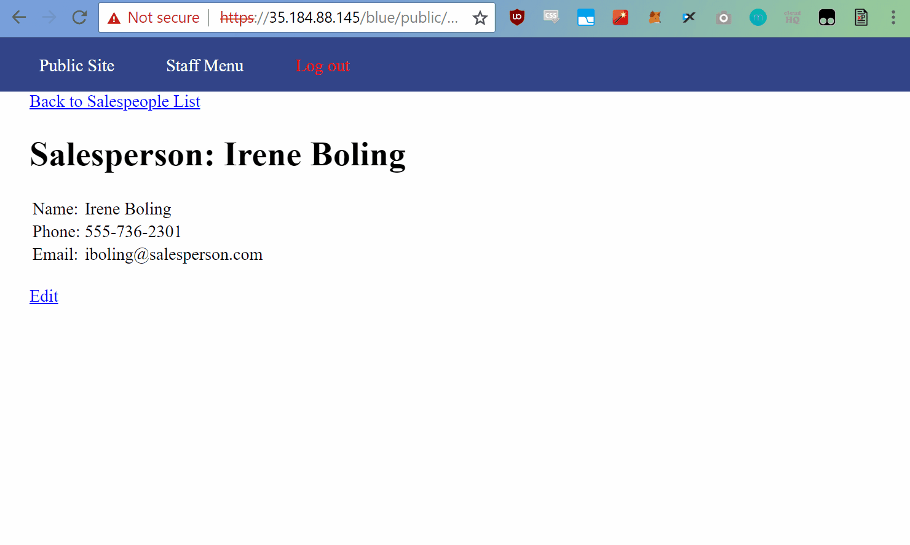
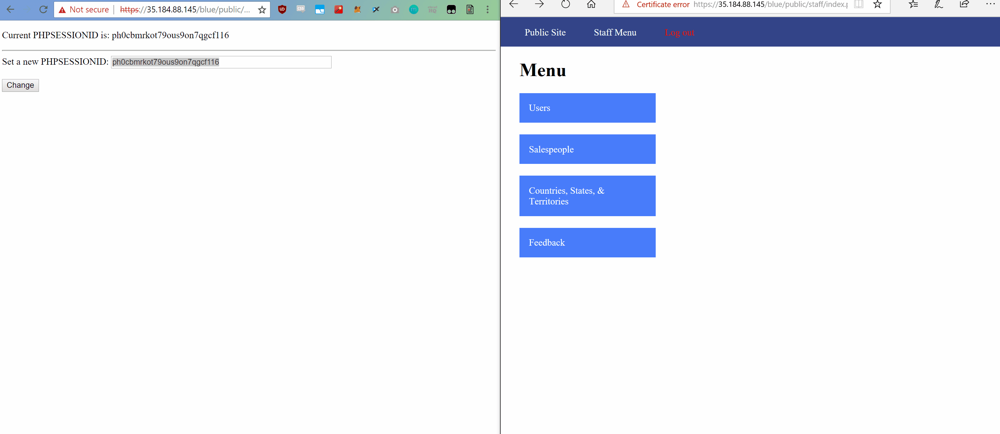
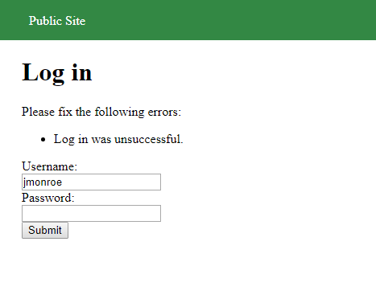
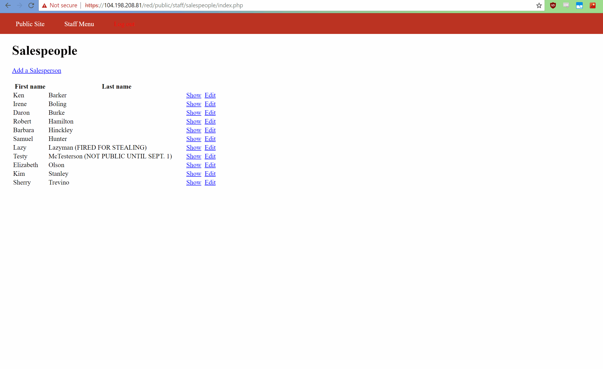
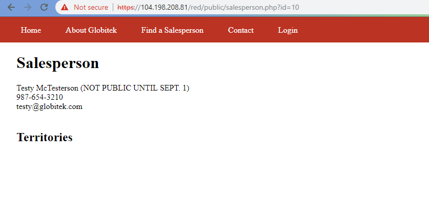

# Project 8 - Pentesting Live Targets

Time spent: **4.5** hours spent in total

> Objective: Identify vulnerabilities in three different versions of the Globitek website: blue, green, and red.

The six possible exploits are:
* Username Enumeration
* Insecure Direct Object Reference (IDOR)
* SQL Injection (SQLi)
* Cross-Site Scripting (XSS)
* Cross-Site Request Forgery (CSRF)
* Session Hijacking/Fixation

Each version of the site has been given two of the six vulnerabilities. (In other words, all six of the exploits should be assignable to one of the sites.)

## Blue

Vulnerability #1: SQL Injection

Appending the sleep function to the end of the sql statement caused the database to pause for 5 seconds, indicating that the sql field was not properly sanitized. 

Vulnerability #2: Session Hijacking

Logged in using another persons session by first logging onto the Blue website, copied the session ID onto another browser, and emulated that session ID on the first browser.

## Green

Vulnerability #1: Cross Site Scripting

Adding `` into the feedback form caused the script to run when the browser renders the feedback.

Vulnerability #2: User Enumeration

When trying to log in to the Red website, if a user exists, the error text will be bold, but if the user does not exist, the error text will be normal. 

## Red

Vulnerability #1: CSRF

I hosted a static html file that had an edit form that would edit one of the exisiting sales people on an Amazon S3 bucket. Loading that form would immediately send the edit request and change that sales person's information.

Vulnerability #2:IDOR

A hidden salesperson can be exposed by editing the id field. 

## Notes

Describe any challenges encountered while doing the work
Hosting the CSRF script on an external source (in this case, an amazon ec2 instance) was slightly more challenging than the other exploits
